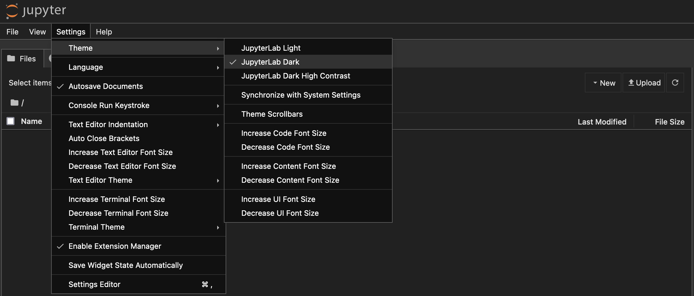
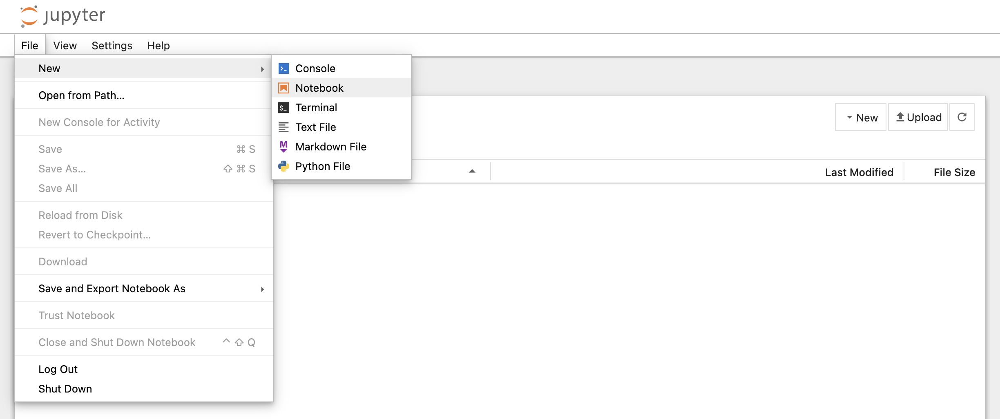
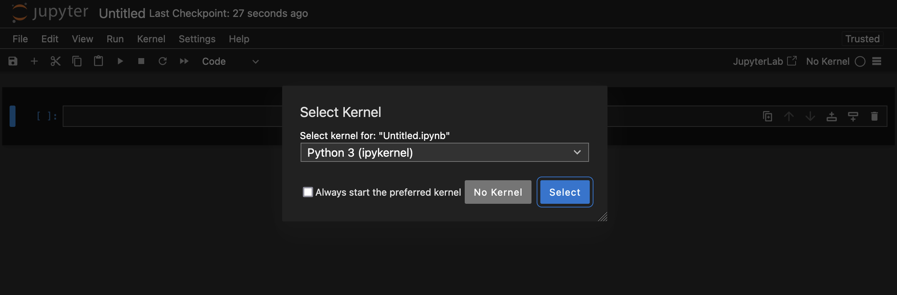
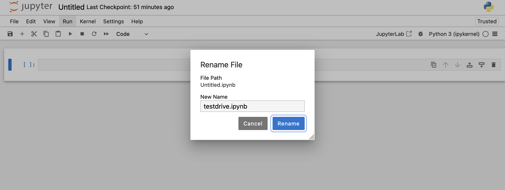
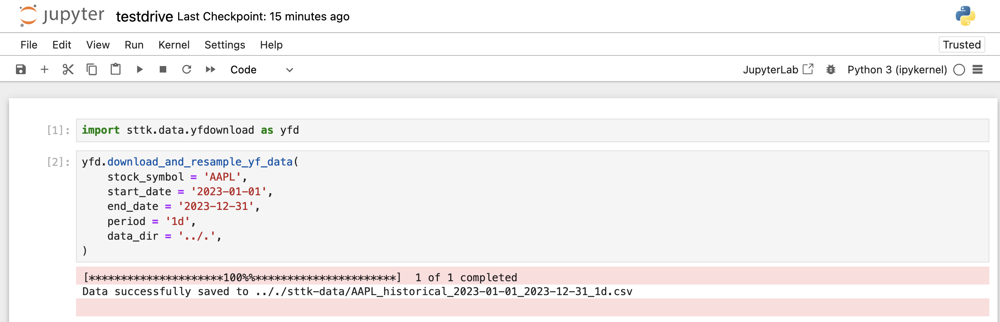
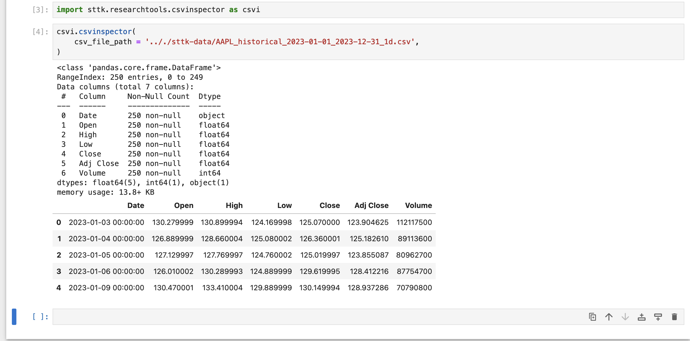
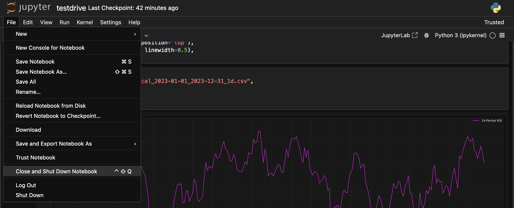
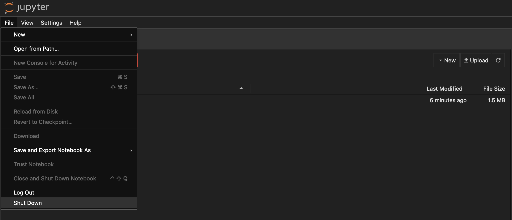

# Quickstart Guide

The Systematic Trading Toolkit (STTK) is a set of open source modules that support quantitative research and the development and execution of systematic trading strategies. This Quickstart Guide will introduce you to some of the key features of the toolkit.


## Installation

Before using this library in your projects, you might first want to create a `sttk-testdrive` directory and a dedicated virtual environment to take this library for a spin:

**Step 1**: Create a project directory.
```bash
mkdir sttk-testdrive
cd sttk-testdrive
```

**Step 2**: Create a virtual environment.
```bash
python3 -m venv ./sttk-testenv
```
This command will create a directory named `sttk-testdrive` (or any name you choose) containing the virtual environment in your local working directory:
```
.
└── sttk-testenv
    ├── bin
    ├── include
    ├── lib
    └── pyvenv.cfg
```

**Step 3**: Activate the virtual environment.

=== "MacOS/Linux"

    ``` bash
    source sttk-testenv/bin/activate
    ```

=== "Windows"

    ```
    sttk-testenv\Scripts\activate
    ```


**Step 4**: Install the `sttk` library via the `pip` package installer:
```bash
pip install sttk
```

To check your installation, run:
```bash
pip show sttk
```


## Setting up Jupyter Notebook 

It is convenient to use a Jupyter Notebook for conducting quantitative research with the Systematic Trading Toolkit.
To do that, you need to install the `notebook` package.

**Step 1**: Install `notebook` package.
```bash
pip install notebook
```

**Step 2**: Create a new folder for saving your Jupyter Notebook(s):
```bash
mkdir notebooks
cd notebooks
```

**Step 3**: After having switched your current working directory to the `notebooks` directory, run:
```bash
jupyter notebook --port=8888
```
Now, a Jupyter Notebook server will run at `localhost:8888`, the port number should be changed if this port is already in use.

**Step 4**: Open up a new Jupyter Notebook and select `Python 3 (ipykernel)` if asked to select a kernel.
<figure markdown="span">
  
  <figcaption>Set the desired theme by clicking on `Settings>Theme>...`</figcaption>
</figure>

<figure markdown="span">
  
  <figcaption>Create new Notebook by clicking on `File>New>Notebook`</figcaption>
</figure>

<figure markdown="span">
  
  <figcaption>Select: Python 3 (ipykernel)</figcaption>
</figure>

**Step 5**: Rename the Notebook file to `testdrive.ipynb` by clicking on `Untitled` in the left upper corner.

<figure markdown="span">
  
  <figcaption>Rename Notebook file to `testdrive.ipynb`</figcaption>
</figure>

The file structure within the `sttk-testdrive` directory should now look like this:
``` hl_lines="2 3 4"
.
├── notebooks
│   ├── .ipynb_checkpoints
│   └── testdrive.ipynb
└── sttk-testenv
    ├── bin
    ├── etc
    ├── include
    ├── lib
    ├── pyvenv.cfg
    └── share
```

## Download Historical Market Data

**Step 1**: Import the necessary module.
```python
import sttk.data.yfdownload as yfd
```

**Step 2**: Download a CSV file containing OHLC data from Yahoo Finance.

```python
yfd.download_and_resample_yf_data(
    stock_symbol = 'AAPL',
    start_date = '2023-01-01',
    end_date = '2023-12-31',
    period = '1d',
    data_dir = '../.', #(1)!
)
```

1.  This guide assumes that you want to save the CSV file containing the downloaded historical market data in a subdirectory named `sttk-data` within your current working directory. If not, you need to specify the path in which the downloaded CSV files should be saved via the `data_dir` argument when calling the `yfd.download_and_resample_yf_data()` function. 

<figure markdown="span">
  
  <figcaption>Jupyter Notebook cell input and output</figcaption>
</figure>

This will create a `sttk-data` directory inside your current working directory and save a file named `AAPL_historical_2023-01-01_2023-12-31_1d.csv` inside this directory.
```
.
├── notebooks
│   ├── .ipynb_checkpoints
│   └── testdrive.ipynb
├── sttk-data
│   └── AAPL_historical_2023-01-01_2023-12-31_1d.csv
└── sttk-testenv
    ├── bin
    ├── etc
    ├── include
    ├── lib
    ├── pyvenv.cfg
    └── share
```

**Step 3 (Optional)**: You can now inspect the downloaded CSV file with STTK's CSV inspector tool.
```python3
import sttk.researchtools.csvinspector as csvi
```
```python
csvi.csvinspector(
    csv_file_path = '.././sttk-data/AAPL_historical_2023-01-01_2023-12-31_1d.csv', 
)
```

<figure markdown="span">
  
  <figcaption>Jupyter Notebook cell input and output</figcaption>
</figure>


## Plotting a Bar Chart

**Step 1**: Import the necessary module.
```python
import sttk.charting.main as charting
```

**Step 2**: Plot a bar chart of the stock data obtained in the previous section (here with a dark color theme):
```python
charting.plot_chart(
    ".././sttk-data/ABR_historical_2023-01-01_2023-12-31_1d.csv",
    theme="dark",
    )
```

<figure markdown="span">
  
  <figcaption>Plotting a Bar Chart</figcaption>
</figure>


## Adding Indicators

**Simple Example**: Let's add a RSI sub-panel to the bottom of the bar chart.
For that we first need to import the necessary module from the `sttk` library:
```python
import sttk.charting.indicators as ind
```

```python
charting.plot_chart(
    ".././sttk-data/ABR_historical_2023-01-01_2023-12-31_1d.csv",
    indicators=[ind.RSI(14)],
    theme="dark",
    )
```

<figure markdown="span">
  
  <figcaption>Plotting a Bar Chart with RSI sub-panel</figcaption>
</figure>


**Complex Example**: Let's add a RSI sub-panel to the top of the bar chart and also add the 50-period High and Low bands (i.e. construct a Donchian Channel) to the main Bar Chart panel.

To do that, let's first create a indicator preset:
```python
complex_example = [
    ind.PeriodHigh(50, linewidth=0.5),
    ind.PeriodLow(50, linewidth=0.5),
    ind.RSI(14, linewidth=0.7, position="top"),
    ind.SimpleMovingAverage(50, linewidth=0.5),
]
```

```python
charting.plot_chart(
    ".././sttk-data/ABR_historical_2023-01-01_2023-12-31_1d.csv",
    indicators=complex_example,
    theme="dark",
    )
```

<figure markdown="span">
  
  <figcaption>Plotting a Bar Chart with RSI sub-panel and Donchian Channel upper and lower bands</figcaption>
</figure>


## Cleaning up

First, close and shut down the Jupyter Notebook.
<figure markdown="span">
  
  <figcaption>Close and shut down Jupyter Notebook</figcaption>
</figure>

Then, shut down the Jupyter Notebook server.
<figure markdown="span">
  
  <figcaption>Shut down Jupyter Notebook server</figcaption>
</figure>

If desired, delete the `sttk-data` folder and delete the `notebooks` directory, ...
```bash
cd ..
rm -r sttk-data
rm -r notebooks
```

... deactivate the virtual environment, and finally ...
```bash
deactivate
```

... delete the whole sttk-testdrive directory:
```bash
cd ..
rm -r sttk-testdrive
```

